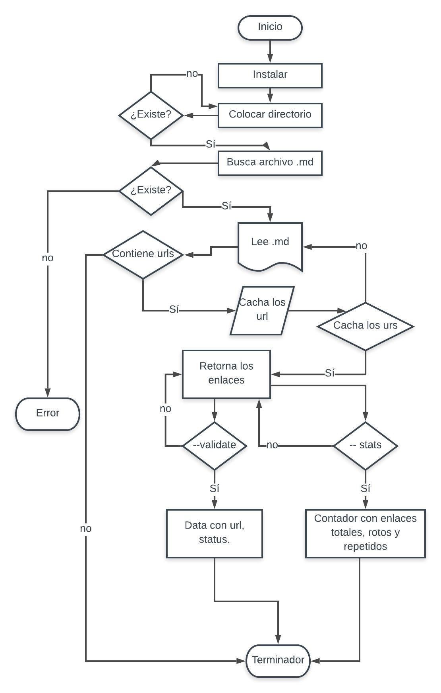
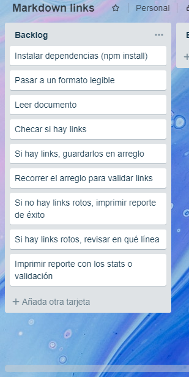

# Markdown Links

## Preámbulo.

[Markdown](https://es.wikipedia.org/wiki/Markdown) es un lenguaje de marcado
ligero muy popular entre developers. Es usado en muchísimas plataformas que
manejan texto plano (GitHub, foros, blogs, ...), y es muy común
encontrar varios archivos en ese formato en cualquier tipo de repositorio
(empezando por el tradicional `README.md`).

Estos archivos `Markdown` normalmente contienen _links_ (vínculos/ligas) que
muchas veces están rotos o ya no son válidos y eso perjudica mucho el valor de
la información que se quiere compartir.

## Introducción.

[Node.js](https://nodejs.org/es/) es un entorno de ejecución para JavaScript
construido con el [motor de JavaScript V8 de Chrome](https://developers.google.com/v8/).
Esto nos va a permitir ejecutar JavaScript en el entorno del sistema operativo,
ya sea tu máquina o un servidor, lo cual nos abre las puertas para poder
interactuar con el sistema en sí, archivos, redes, ...

## Documentación.
### Archivos del proyecto.


- `README.md` contiene la desripción del proyecyo.
- `index.js`.
- `package.json` con nombre, versión, descripción, autores, licencia,   dependencias, scripts.
- `.editorconfig` con configuración para editores de texto.
- `.eslintrc` con configuración para linter.
- `.gitignore` para ignorar `node_modules` u otras carpetas que no deban
  incluirse en control de versiones (`git`).

### Diagrama de flujo.



### Backlog.



### Documentación Técnica.

La librería está hecha con NodeJS. Utilizando lo siguiente:
- path
- fs
- Markdown Link Extractor
- Colors
- node-fetch
- Jest para los test

### Guía de instalación y uso.


```sh
$ md-links ./some/example.md --stats --validate
Total: 3
Unique: 3
Broken: 1
```

  